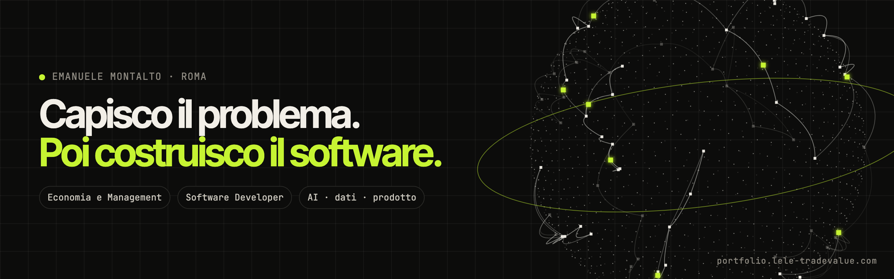
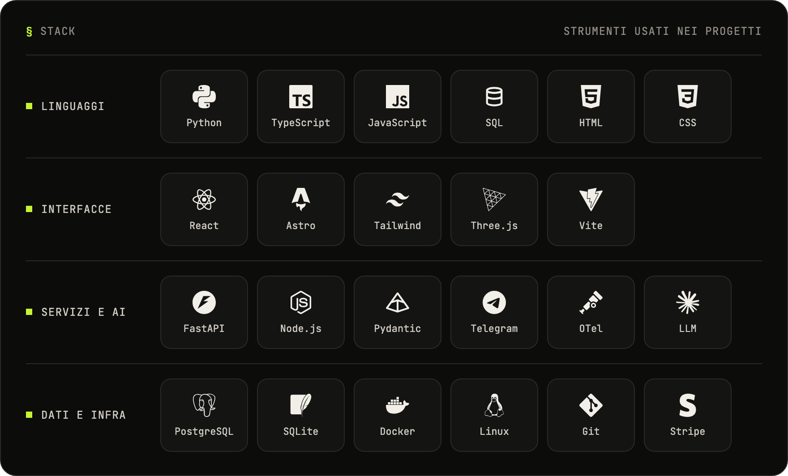

<picture>
  <source media="(prefers-color-scheme: dark)" srcset="assets/banner-dark.png" />
  <source media="(prefers-color-scheme: light)" srcset="assets/banner-light.png" />
  
</picture>

## Ciao, sono Emanuele 👋

Vengo dall’economia e scrivo software. Mi sono laureato in **Economia e Management** a Tor Vergata, dove sto finendo la magistrale, e da marzo 2025 lavoro come **Software Developer in Caes Software**, tra requisiti, analisi dei processi e applicazioni web in React e TypeScript.

Fuori dall’orario d’ufficio costruisco assistenti AI, piattaforme di analisi e piccoli prodotti. Il filo conduttore è sempre lo stesso: capire come funziona davvero un’attività, poi costruire lo strumento che la fa funzionare meglio.

**[→ Portfolio con le demo](https://portfolio.lele-tradevalue.com)** · [CV](https://portfolio.lele-tradevalue.com/cv/emanuele-montalto-profilo.pdf) · [English résumé](https://portfolio.lele-tradevalue.com/cv/emanuele-montalto-en.pdf) · [LinkedIn](https://www.linkedin.com/in/emanuele-montalto/) · [montalto36@gmail.com](mailto:montalto36@gmail.com)

---

### Progetti in evidenza

Il codice di questi progetti è privato: per ognuno c’è un caso studio con un **prototipo che puoi provare** nel browser.

| | Progetto | In breve |
|---|---|---|
| 01 | **[FIDIA](https://portfolio.lele-tradevalue.com/progetti/fidia/)** · project work magistrale | Un caso di governance aziendale trasformato in una piattaforma web di 35 schermate: modelli 3D, ogni numero collegato alla sua fonte, un assistente AI con un controllo indipendente. **[Online](https://fidia.lele-tradevalue.com/)** |
| 02 | **[AURIGA](https://portfolio.lele-tradevalue.com/progetti/auriga/)** · hackathon Oracle × Scuderia Tor Vergata | Un ingegnere di pista AI: un supervisore e cinque specialisti leggono la telemetria, citano il regolamento e simulano la gara prima di consigliare il pit stop. |
| 03 | **[E-commerce su Telegram](https://portfolio.lele-tradevalue.com/progetti/ecommerce-assistente-ai/)** | Due bot per un negozio: il cliente compra in chat, il titolare evade ordini e pubblica prodotti da una foto. L’AI propone, le persone confermano. |
| 04 | **[RECALL](https://portfolio.lele-tradevalue.com/progetti/recall/)** | Salvi uno screenshot in un gesto: lo capisce, lo collega al resto e te lo ripropone quando serve. |
| 05 | **[Agentkit](https://portfolio.lele-tradevalue.com/progetti/agentkit/)** | La mia libreria Python per agenti AI, usata in tutti i progetti qui sopra: strumenti tipizzati, approvazione umana, fallback tra provider. |
| 06 | **[TRADEVALUE](https://portfolio.lele-tradevalue.com/progetti/tradevalue/)** | Un terminale di ricerca sui mercati con agenti specializzati e un sistema di sicurezza sempre acceso. |
| 07 | **[Splitro](https://portfolio.lele-tradevalue.com/progetti/splitro/)** | Dividere le spese dei viaggi in auto partendo da una frase: l’AI legge, il codice conta al centesimo. |
| 08 | **[ReduceAll](https://portfolio.lele-tradevalue.com/progetti/reduceall/)** | Comprimi un file fin sotto il limite di email o PEC, sul tuo dispositivo, senza caricarlo. |
| 09 | **[Assistente per la casa](https://portfolio.lele-tradevalue.com/progetti/assistente-domotico/)** | Parli alla casa: le azioni sicure partono, quelle critiche chiedono conferma, quelle sbagliate vengono fermate. |

Le panoramiche pubbliche sono anche qui su GitHub, nei repository `*-showcase` e nel [catalogo dei progetti](https://github.com/lelee25/progetti-showcase).

---

### Con cosa lavoro

<picture>
  <source media="(prefers-color-scheme: dark)" srcset="assets/stack-dark.png" />
  <source media="(prefers-color-scheme: light)" srcset="assets/stack-light.png" />
  
</picture>

E dal lato economico: analisi dei processi, raccolta dei requisiti, lettura di bilanci e governance, analisi di mercato.

---

### Qualche fatto

- 🏆 **Primo premio** all’Ideathon *Blockchain Innovation Day* di ICP Hub Italia (Roma, 2024).
- 🏁 *AI Race Engineer Challenge* di Oracle con la Scuderia Tor Vergata (maggio 2026), con AURIGA.
- 🇬🇧 Inglese **B2** certificato.
- 📈 3.577 contributi negli ultimi 12 mesi (al 7 ottobre 2026, inclusa l’attività privata).

<b>In English</b>

I come from economics and I write software. I graduated in **Economics and Management** at Tor Vergata University in Rome, where I’m finishing my master’s, and since March 2025 I’ve worked as a **Software Developer at Caes Software** — requirements, process analysis and React/TypeScript web apps.

On my own time I build AI assistants, analysis platforms and small products. The common thread: understand how a business really works, then build the tool that makes it work better. Every featured project above has a case study with a **working prototype** on my [portfolio](https://portfolio.lele-tradevalue.com/en/).

